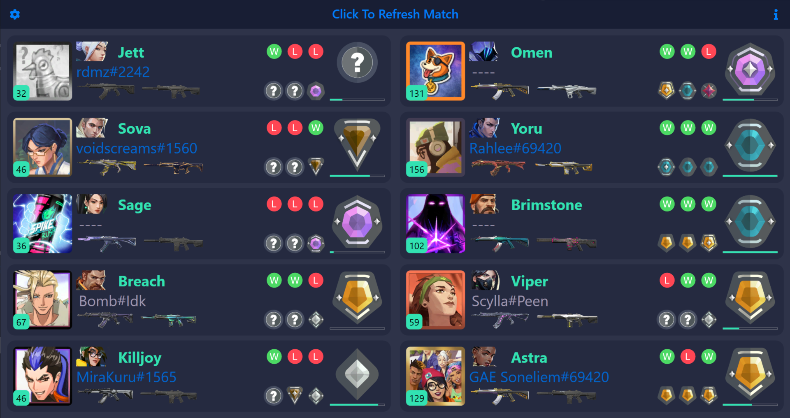
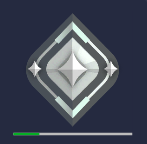
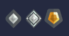
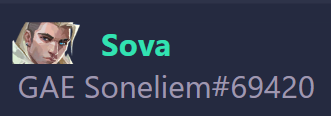
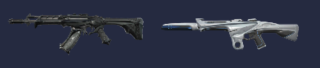
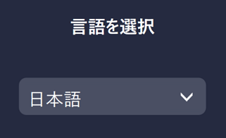
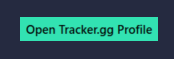
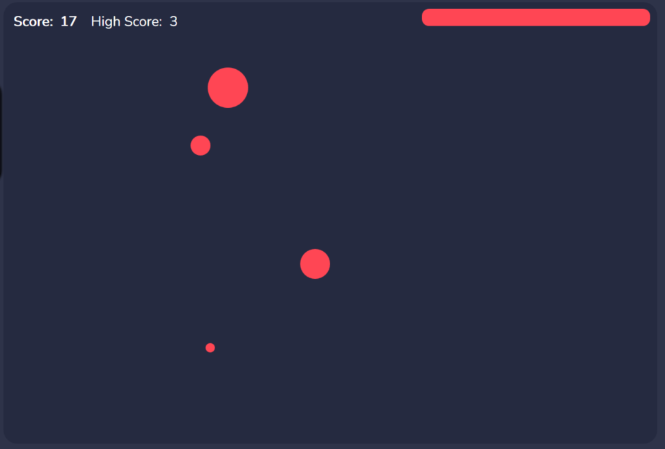
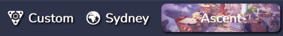
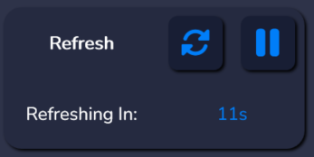

  

<h3 align="center">WAIUA</h3>
<h4 align="center">Who Am I Up Against?</h4>
<a href="https://waiua.sonel.dev"><h1 align="center">waiua.sonel.dev</h1></a>

  

    A Windows application to view player ranks and other info in a live Valorant Match

    

    
    
    
    
    

   

  
Table of Contents

  <ol>
    <li>
      <a href="#about-the-project">About The Project</a>
      <ul>
      <li><a href="#current-features">Current Features</a></li>
      </ul>
    </li>
    <li>
      <a href="#getting-started">Getting Started</a>
      <ul>
        <li><a href="#prerequisites">Prerequisites</a></li>
        <li><a href="#installation">Installation</a></li>
      </ul>
    </li>
    <li><a href="#usage">Usage</a></li>
    <li><a href="#roadmap-and-known-bugs">Roadmap And Known Bugs</a></li>
    <li><a href="#built-with">Built With</a></li>
    <li><a href="#contributing">Contributing</a></li>
    <!-- <li><a href="#Sponsors">Sponsors</a></li> -->
    <li><a href="#Translations">Translations</a></li>
    <li><a href="#contact">Contact</a></li>
    <li><a href="#acknowledgements">Acknowledgements</a></li>
    <li><a href="#DISCLAIMER">Disclaimer</a></li>
  </ol>

## About The Project

"Who Am I Up Against?" (WAIUA) is simple Windows app that lets you see the ranks, recent game stats and other info of players in a live Valorant match while you're still playing it. Below are the current features that are in the app.

### Current Features

|Current Rank and Rank Progress|Past three ranks (from last 3 acts)|RR lost or gained in last three competitive games|Account Level and Agent Image|
|:---:|:---:|:---:|:---:|
|||||

|In-game and Agent Name|Vandal And Phantom Skin|Party Indicators|Fully translated into 15+ languages|
|:---:|:---:|:---:|:---:|
|||||

|Tracker.gg Intergration|Mini-Aim Trainer|Support For all Game Modes|Auto Refresh and Updates|
|:---:|:---:|:---:|:---:|
|||||

## Getting Started

To get the app up and running follow these simple steps.

### Prerequisites

* Windows 64-bit (If you're able to run Valorant on it you'll be fine)
* .NET (will be automatically installed during installation)

### Installation

1. Download [the latest installer](https://github.com/Soneliem/WAIUA/releases/latest/download/WAIUA.exe)
2. Run the .exe (If a blue box saying "Windows protected your PC" shows up, click `More Info` and then `Run Anyway`)
3. Follow the steps to install WAIUA

## Usage

1. Open the app
2. WAIUA will automatically check for new matches or wait for a match like a good boi
3. Win games (unless you find out you're playing against a smurf. In that case RIP your RR)

## Roadmap and Known Bugs

Please check the [issues tab](https://github.com/Soneliem/WAIUA/issues) before making a new issue. My [Discord Server](https://discord.gg/X7CYCeZSRK) has a list of known bugs and upcoming features.

## Built With
* [WPF](https://docs.microsoft.com/en-us/dotnet/desktop/wpf/?view=netdesktop-6.0)
* [C#](https://docs.microsoft.com/en-us/dotnet/csharp/)
* [.NET 6.0](https://dotnet.microsoft.com/)

I knew none of these things before making this lol

#### Packages that I used/ recommend:
* [RestSharp](https://restsharp.dev/) for API requests
* [System.Text.Json](https://docs.microsoft.com/en-us/dotnet/api/system.text.json) to deserialise JSON. Source generators are a Godsend
* [Windows Community Toolkit MVVM](https://docs.microsoft.com/en-us/windows/communitytoolkit/mvvm/introduction) for MVVM. Ty for Source Generators too
* [AutoUpdater.NET](https://github.com/ravibpatel/AutoUpdater.NET) for auto updates
* [Inno Setup](https://jrsoftware.org/isinfo.php) to install WAIUA
* [FontAwesome](https://fontawesome.com/license) for icons. I'm also supposed say that I changed the colours so here it is

## Why I Made This

The main reason I made this was to detect smurfs. This app basically settles the debates between team members or the enemy. The set of available features was chosen carefully to maintain the competitive integrity of the game. Many suggestions that I get are declined due to this (unless a certain "competing" verified app implements it). 

Another reason to making this was that I wanted some experience with .NET and GUI apps. This application uses C# as the backend, WPF as the frontend and .NET as the framework. I knew none of these when I began, so this was a fun journey. I've gained alot of experice of how to and how not to (mostly the latter) use WPF and C#. 

## Contributing

I welcome any sort of contribution. Please remember that translations are managed externally as mentioned below.

<!-- TODO: Fix -->
<!-- ## Sponsors
This project is sponsored by: --> 

<!-- sponsors --><!-- sponsors -->  

<!-- Thank you for your support! Any donation of $5 and over will addionally get you into the app's main page.   -->

## Translations

WAIUA Supports full localization and instructions to help with translations can be found in [Localization](https://github.com/Soneliem/WAIUA/blob/master/Localization.md)

## Contact

**Official Website:** [waiua.sonel.dev](https://waiua.sonel.dev)  
**Discord:** Soneliem#4194  
**Email:** [waiua@sonel.dev](mailto:waiua@sonel.dev)  
**Project Link:** [https://github.com/Soneliem/WAIUA](https://github.com/Soneliem/WAIUA)  
**Discord Server:**  
  

## Acknowledgements

* [techchrism for work on documenting Valorant endpoints](https://github.com/techchrism/valorant-api-docs)
* [Valorant-API.com for all images, etc](https://valorant-api.com/)
* [The guys on the Valorant App Developers Discord Server](https://discord.gg/a9yzrw3KAm)
* This project uses Riot's in-game API for most of the information

## DISCLAIMER
THIS PROJECT IS NOT ASSOCIATED OR ENDORSED BY RIOT GAMES. Riot Games, and all associated properties are trademarks or registered trademarks of Riot Games, Inc.
By using this application, you agree that you, the individual, are knowingly accessing all information required to be displayed.

